# Design Patterns

## **Creational:**
1) Singleton
2) Builder
3) Prototype
4) Factory
5) AbstractFactory

## **Singleton**

Singleton pattern is a design solution where an application wants to have one and only one instance of any class, in all possible scenarios without any exceptional condition.

### **Implementing Singleton**

In computer programming, **lazy initialization** is the tactic of delaying the creation of an object, the calculation of a value, or some other expensive process, until the first time it is needed. In a singleton pattern, it restricts the creation of the instance until it is requested for first time.

On the first invocation, the above method will check if the instance is already created using the instance variable. If there is no instance i.e. the instance is null, it will create an instance and will return its reference. If the instance is already created, it will simply return the reference of the instance.


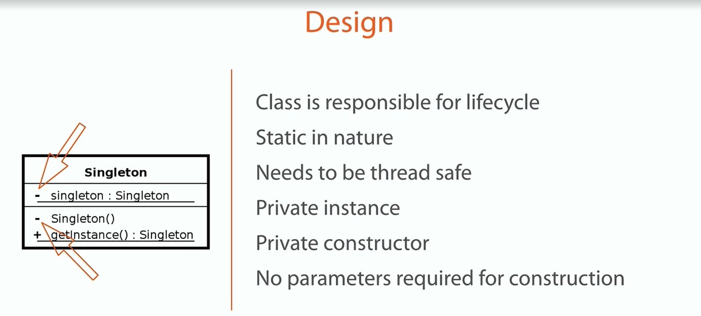
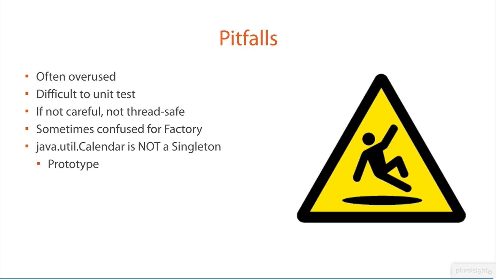

## **Builder**

### **Problem Statement**
We already know the benefits of immutability and immutable instances in an application. If you have any questions about it, let me remind you of the String class in Java. And as I already said, the builder pattern helps us in creating immutable classes with a large set of state attributes.

Let’s discuss a common problem in our application. In any user management module, the primary entity is User, let’s say. Ideally and practically as well, once a User object is fully created, we will not want to change its state.

Now, let’s assume, our User object has the following 5 attributes i.e. firstName, lastName, age, phone and address.

In normal practice, if we want to make an immutable User class, then we must pass all five information as parameters to the constructor. It will look like this:
```
public User (String firstName, String lastName, int age, String phone, String address) {
    this.firstName = firstName;
    this.lastName = lastName;
    this.age = age;
    this.phone = phone;
    this.address = address;
}
```
Now what if only firstName and lastName are mandatory, and the rest 3 fields are optional? We need more constructors. This problem is called the **telescoping constructors** problem.

```
public User (String firstName, String lastName, int age, String phone){ ...	}
public User (String firstName, String lastName, String phone, String address){ ...	}
public User (String firstName, String lastName, int age){ ...	}
public User (String firstName, String lastName){ ...	}
```

One way is to create more constructors, and another is to lose the immutability and introduce setter methods. 
Here, the builder pattern will help you to consume additional attributes while retaining the immutability of the User class.

### **Implementing Builder Pattern**

Build desired User instance with all mandatory attributes and a combination of optional attributes, without losing the immutability. 
User object created with builder pattern does not have any setter method, so its state can not be changed once it has been built. This provides the desired immutability.

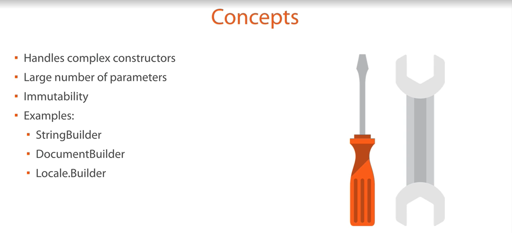
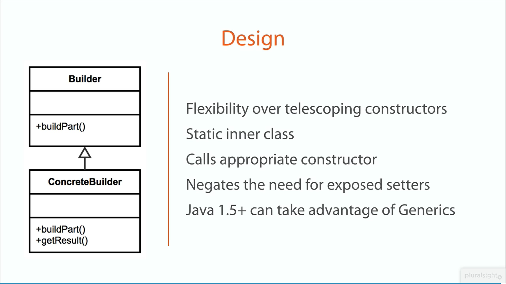


## **Prototype**
A prototype is a template of any object before the actual object is constructed. In java also, it holds the same meaning. Prototype design pattern is used in scenarios where application needs to create a number of instances of a class, which has almost same state or differs very little.

In this design pattern, an instance of actual object (i.e. prototype) is created on starting, and thereafter whenever a new instance is required, this prototype is cloned to have another instance. The main advantage of this pattern is to have minimal instance creation process which is much costly than cloning process.

https://howtodoinjava.com/design-patterns/creational/prototype-design-pattern-in-java/

### **Participants**
**Prototype**: This is the prototype of actual object as discussed above.

**Prototype registry**: This is used as registry service to have all prototypes accessible using simple string parameters.

**Client**: Client will be responsible for using registry service to access prototype instances.

### **Problem Statement**

Let's understand this pattern using an example. I am creating an entertainment application that will require instances of Movie, Album and Show classes very frequently. I do not want to create their instances everytime as it is costly. So, I will create their prototype instances, and everytime when i will need a new instance, I will just clone the prototype.

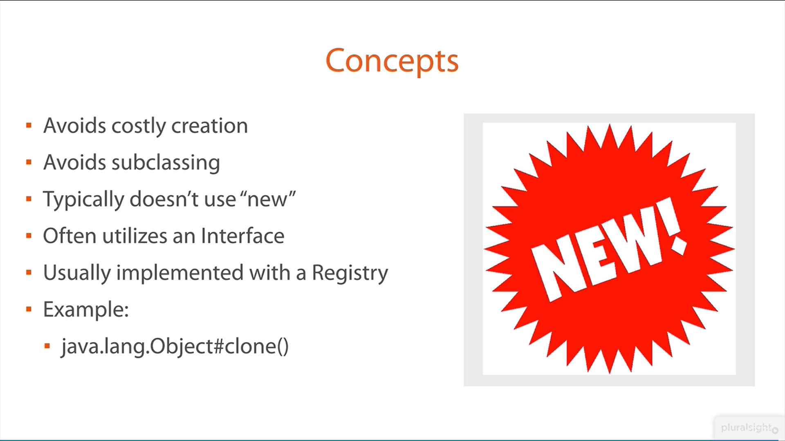
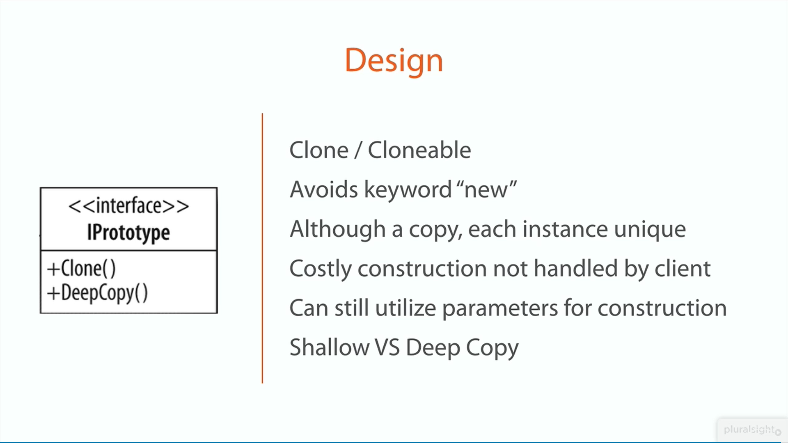


## **Factory Method**

Factory pattern introduces loose coupling between classes which is the most important principle one should consider and apply while designing the application architecture.

### **Benefits**
The creation of an object precludes its reuse without significant duplication of code.
The creation of an object requires access to information or resources that should not be contained within the composing class.
The lifetime management of the generated objects must be centralized to ensure a consistent behavior within the application.

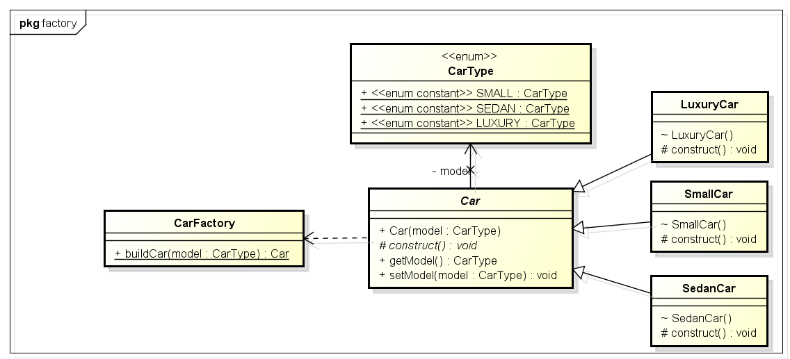
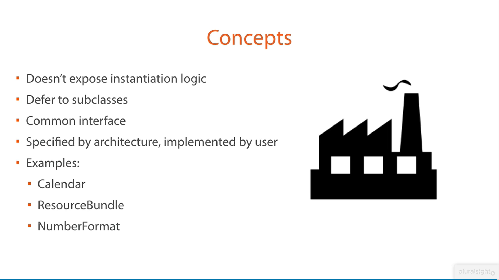
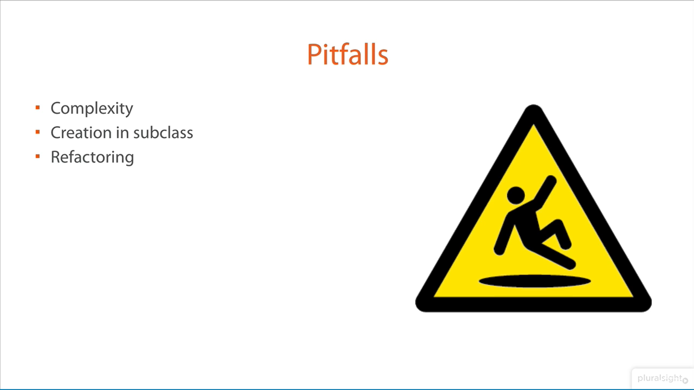

## **Abstract Factory Pattern**

In “factory design pattern“, we discussed how to abstract the car making process for various car model types and their additional logic included in car making process. Now, imagine if our car maker decides to go global.

To support global operations, we will require to enhance the system to support different car making styles for different countries. For example, in some countries we see steering wheel on left side, and in some countries it is on right side. There can be many more such differences in different part of cars and their making processes.

To describable the abstract factory pattern, we will consider 3 kind of makes – the USA, Asia, and the default for all other countries. Supporting multiple locations will need critical design changes.

Firstly, we need car factories in each location specified in the problem statement. i.e. USACarFactory, AsiaCarFactory and DefaultCarFactory. Now, our application should be smart enough to identify the location where is being used, so we should be able to use appropriate car factory without even knowing which car factory implementation will be used internally. This also saves us from someone calling the wrong factory for a particular location.

So basically, we need another layer of abstraction which will identify the location and internally use correct car factory implementation without even giving a single hint to the user. This is exactly the problem, which abstract factory pattern is used to solve.

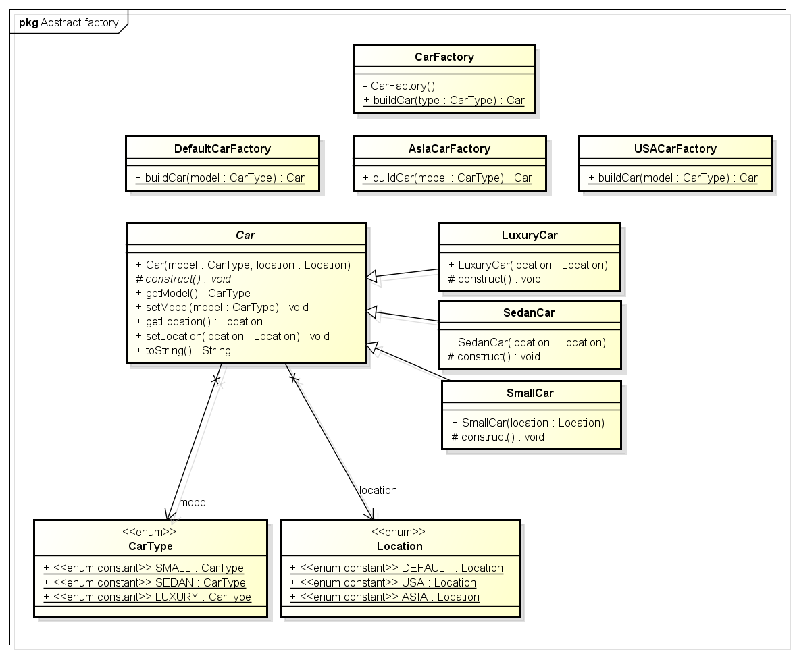
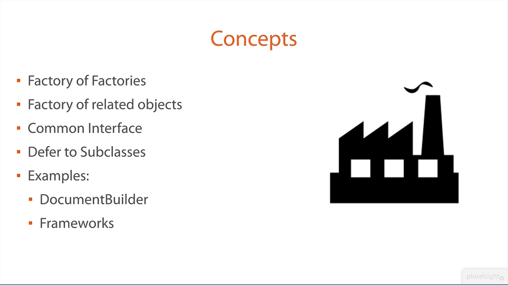
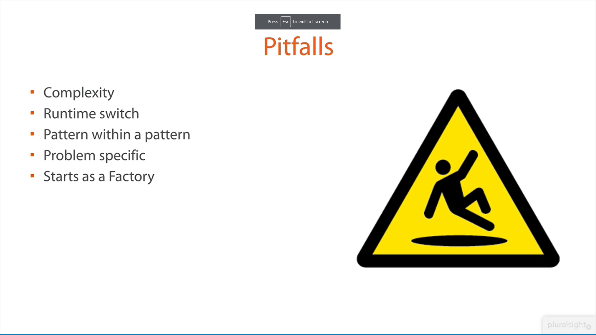